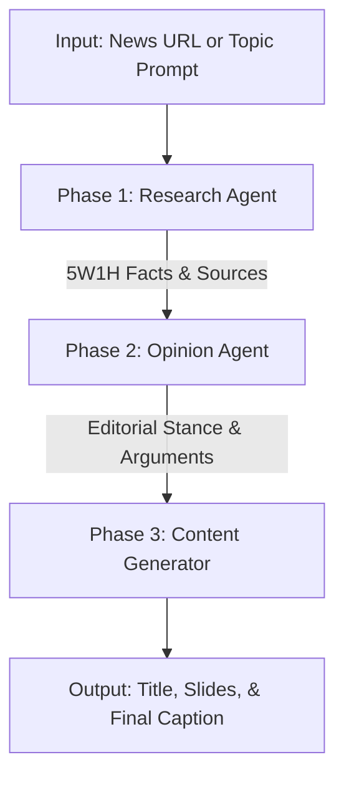

# Helper Scripts & CLI Runners

This directory contains standalone CLI scripts for testing, debugging, and previewing different stages of the content generation pipeline.

---

## 1. Text-Only Pipeline Runner (`test_pipeline_text.ts`)

Executes the complete editorial intelligence chain (Research Agent -> Opinion Agent -> Content Generator) **without** running Puppeteer, rendering HTML canvas to images, uploading to S3, or scheduling to Buffer.

### Architecture Flow



### Usage

```bash
# Run with default sample input
npm run test:pipeline:text

# Run with custom URL and instructions via CLI argument
npx tsx scripts/test_pipeline_text.ts "https://english.almayadeen.net/articles/why-the-israelis-are-so-afraid-of-a-liberated-yemen Kenapa Israel takut Yaman Merdeka oleh Ansarullah"

# Run with environment variable
INPUT_TEXT="https://news.example.com/breaking-news" npm run test:pipeline:text
```

### Execution Pipeline Matrix

| Step | Agent / Module | Responsibility | Key Output |
| :--- | :--- | :--- | :--- |
| **Phase 1** | `src/agents/editorial/research.ts` | Strictly neutral 5W1H investigative research via Firecrawl/Exa tools. | Factual research summary, candidate source links, curated editorial images. |
| **Phase 2** | `src/agents/editorial/opinion.ts` | Formulates editorial stance based on the connection's `editorialGuidelines`. | Core thesis (*Tesis Utama*), critical arguments (*Poin Kritis*), and reflection punchline. Moderation applied. |
| **Phase 3** | `generateCarouselDarkContent` | Synthesizes final title, multi-slide copy, and Instagram caption. | Final title with HTML tags, slide array, source metadata, and Instagram caption. |

---

## 2. Source QR Code Render Preview (`render_source_qr_preview.ts`)

Renders a standalone preview of the Source QR Code slide using Puppeteer and sharp.

### Usage

```bash
npx tsx scripts/render_source_qr_preview.ts
```

Output image will be saved to `tests/output/sample_source_qr.png`.
